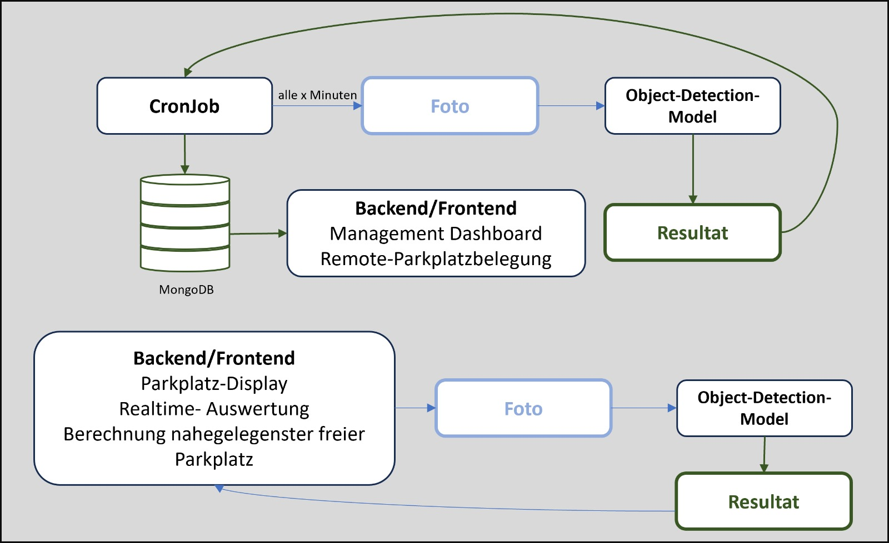

# 🚗 Parking Space Detection Project

⚡ Find your parking spot with ease ⚡️️️

## 📷 Picture Analysis Process

This project aims to create a model that detects whether a parking space is occupied or not. It's designed for situations where a user is in front of a parking lot, presses a button, and then a camera takes a photo for analysis. The system then provides instructions on where the user should park.

The process is as follows:


## ⚙️ Project Structure

Thanks to [Cookie Cutter](https://drivendata.github.io/cookiecutter-data-science/)

## 🛠️ Setup and Installation

To set up this project:

1. Clone the repository.
2. Install dependencies using ```pip install -r requirements.txt``` from the root directory.
3. Start the app with flask ```flask --app app run``` from the src/backend directory.
4. Profit 💰

## 🐍 Python Version

This project is built with Python 3.9.1.
